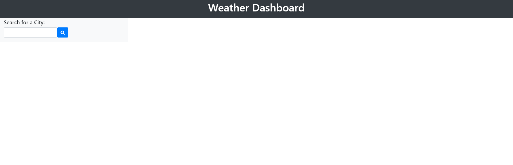
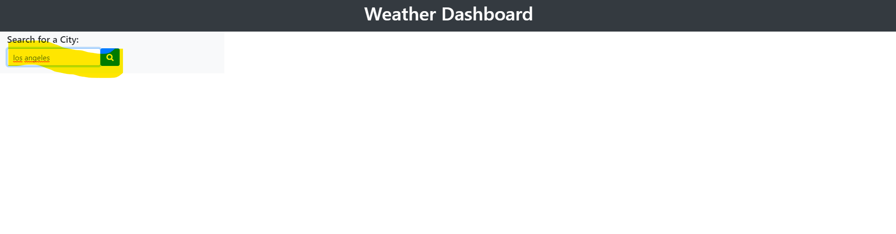
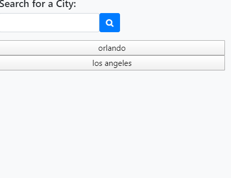
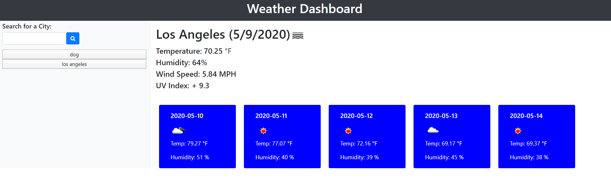

# Weather-App

this app allows for the user to look up their local weather and it also returns a five day forecast. 

I used the openweather api to gather this information. It also stores the data from previous searches in local storage. the uer can click on the saved city and check its weather without having to type in the city name. 

The only problems I encountered (that I will work on once I circle back to it) was to not create a duplicate of the button. I started working on the indexOf() but I couldn't get it to work. I also couldn't get it to not add a city that doesn't exist.

 

